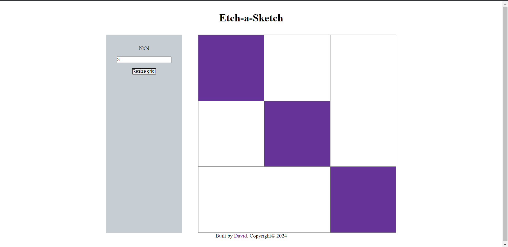

# Etch-a-Sketch
### MVP v1

This webpage is a digital version of the classic Etch-a-Sketch toy. It allows users to draw on a grid of square divs by hovering the mouse over them. The grid size can be changed dynamically based on user input.

## Technologies Used
- HTML
- CSS (Flexbox)
- JavaScript

## How to Use
- The initial grid size is set to 9x9.
- Hover over the grid squares to draw on them.
- Use the input field and the "Resize grid!" button to change the - size of the grid.
- Click the "Resize grid!" button to generate a new grid with the specified size.

## What I learnt
- Creating HTML elements with JS.
- Appending children to HTML elements.
- Adding classes through `classList`.
- Managing event listeners.
- Retrieving and working with user input.

## Challenges and Future Improvements
- The current implementation does not include advanced styling and is focused on functionality.
- The JavaScript code is to be refactored to improve readability and maintainability.
- Additional features are to be added, such as different pen colors, eraser functionality, random color mode.